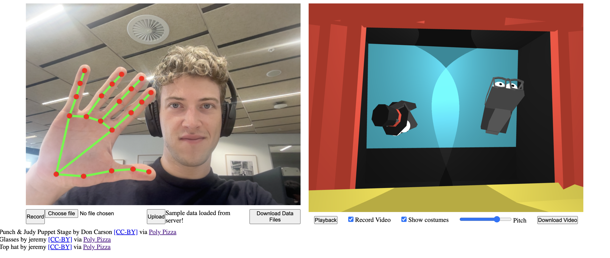

# Puppet Show

## Requirements

- Node.js (mine is v21.1.0)
- npm (mine is 10.2.0)
- A modern browser like Chrome or Firefox (developed in Chrome)

## Project setup & instructions

1. Run `npm install` to install the required dependencies.
2. Run `npm run dev` to start the development server.
3. Open `http://localhost:5173` in your browser. 
   1. The port may vary depending on your system configuration.
   2. Use a modern browser like Chrome or Firefox for the best experience.
4. Allow access to your camera and microphone when prompted. Otherwise the app won't work.
5. There is already a sample recording available. Press the "playback" button to see it.
6. Press the "record" button to record your own puppet show. Press "stop recording" to stop recording.
7. Press the "playback" button to see your recording.
8. Press the "download" button to download the recording as a video. Make sure "Record Video" is toggled.
9. Press the "costumes" button to toggle the costumes on and off.
10. Use the "pitch" slider to adjust the pitch of the voices.

This project is a virtual hand puppet show that combines Google’s MediaPipe hand-tracking with Three.js. Users record hand and voice input to create a puppet show with two talking figures. MediaPipe provides 21 hand landmarks, which I simplify into five key points and a directional vector for each puppet. After recording, users can playback the show, toggle on or off costumes, adjust the voices pitch, and navigate around the 3D scene. The recording can then be saved as a video.

[Video demonstration](demo_video.mp4)

## Feature #1: Recording hand poses
MediaPipe’s hand tracking detects a set of 21 hand landmarks, allowing each camera frame to be processed using a combination of computer vision and machine learning. These landmarks are transformed into hand poses that excludes recordings with low confidence, minimal motion and small time frames to reduce data load. Filtered points get transformed into a puppet pose with five main points and a directional vector, that make up the anchor points of the three puppet parts: a palm box and two hinged boxes for the fingers and thumb.
I’m very pleased with how this feature came out. The recording system is simple and adaptable, with a clear separation between data recording and visual presentation.
With a clear vision of the final application in my head, the process of transforming MediaPipe’s output into a normalised 3D space for the puppet’s key points went straightforward. To streamline development, I recorded sample data early on, which sped up testing and refinement. Regularly refactoring the code kept it organised and made adjustments easier later on.
I wouldn’t change anything about my approach. Setting up sample data early and planning for organised, flexible code were crucial for a smooth workflow. Focusing on a small subset of features I wanted to implement was key in implementing my vision.

## Feature #2: Playback of recordings
I used Three.js as my 3D environment of choice. During playback the boxes that make up the puppet are positioned equal to the most current timestamp of puppet poses. I initially tried adding interpolation between poses to account for low-end devices with lower frame rates, but it looked unnatural, so I reverted to a simpler approach. In parallel, audio plays alongside the puppets, with optional pitch adjustments for a comical effect. Users can also record a video of the scene and download it afterwards.

I’m equally happy with this feature. The puppets are expressive and entertaining. Adding costumes and a 3D theatre background enhances the overall experience.

I planned the visuals and functionality for my 3D scene beforehand on paper. This helped in getting a clear picture of what needed to be done in order to make things work.

Again, I wouldn’t change much. Clear planning, deadlines, and prioritising core elements helped me finish everything I intended. While additional features were planned, which can be seen below, time constraints limited my scope.

## Outlook
Features I’d like to add include:
- [x] Adjusting pitch to reflect the speaking hand, e.g., a high pitch for the left and a low pitch for the right
- [ ] Using LLMs to analyse and title the puppet show based on the voice recording.
- [ ] Offloading playback to a backend service to generate a video automatically rather than handling everything in frontend.
- [ ] Enhancing visuals by adding theatre curtains, shadows, lighting, and more realistic sock puppet models controlled using inverse kinematics.

## Verdict
Overall I’m very pleased with how this project turned out. The idea feels fun and unique, and the basic prototype performed smoothly. I enjoyed adding details and refining the code, and I’d love to expand this project further in the future.

## Credits

The project used a fork starter template from GitHub user [pachoclo](https://github.com/pachoclo/vite-threejs-ts-template)

Punch & Judy Puppet Stage by Don Carson [CC-BY](https://creativecommons.org/licenses/by/3.0/) via [Poly Pizza](https://poly.pizza/m/9i5mmOwt7cu)\
Glasses by jeremy [CC-BY](https://creativecommons.org/licenses/by/3.0/) via [Poly Pizza](https://poly.pizza/m/9i5mmOwt7cu)\
Top hat by jeremy [CC-BY](https://creativecommons.org/licenses/by/3.0/) via [Poly Pizza](https://poly.pizza/m/e5kV1Y_cZJt)\
Santa Hat by Joe Dorman [CC-BY](https://creativecommons.org/licenses/by/3.0/) via [Poly Pizza](https://poly.pizza/m/3QKT0IHKALm)
